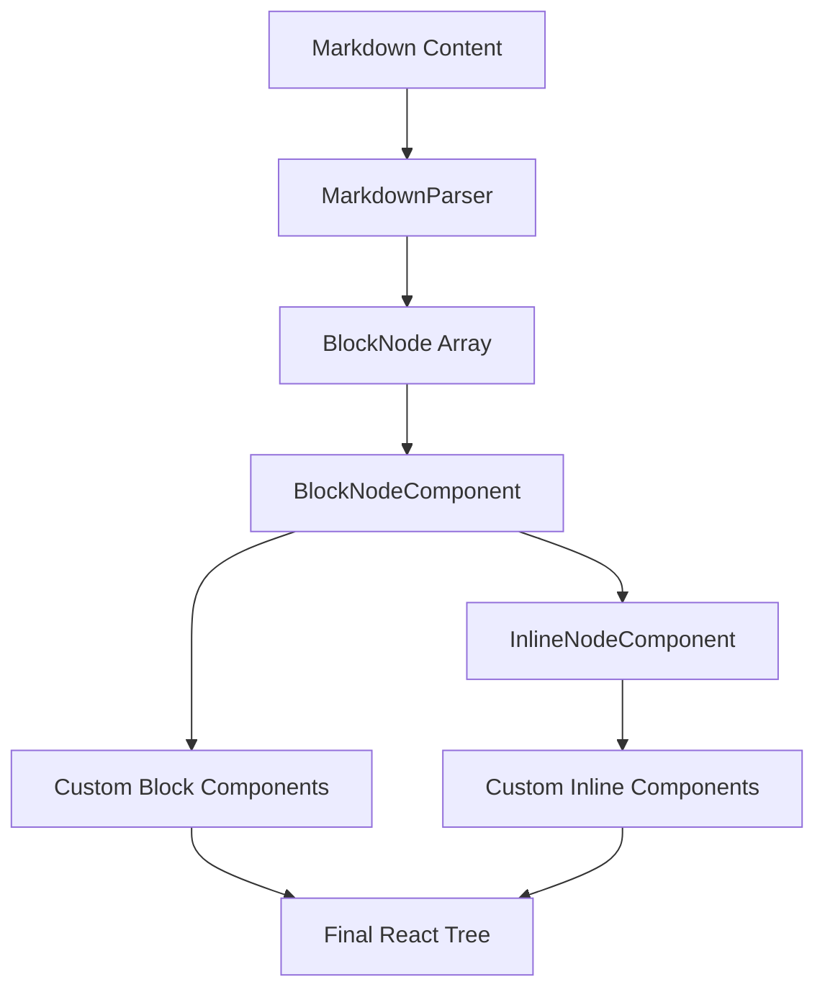

Custom components give you full control over how markdown is rendered in React. This guide covers advanced patterns for building interactive, accessible, and feature-rich markdown renderers.

## Component architecture

The Markdown component uses a two-level rendering system:



## Creating reusable component sets

Define component sets for consistent styling across your application:

```tsx
import type { MarkdownComponents } from "react-markdown-parser";

// Define your component library
export const blogComponents: Partial<MarkdownComponents> = {
  Heading: ({ level, children }) => {
    const sizes = {
      1: "text-4xl font-bold mt-8 mb-4",
      2: "text-3xl font-semibold mt-6 mb-3",
      3: "text-2xl font-semibold mt-4 mb-2",
      4: "text-xl font-medium mt-3 mb-2",
      5: "text-lg font-medium mt-2 mb-1",
      6: "text-base font-medium mt-2 mb-1",
    };
    const Heading = `h${level}` as const;
    return <Heading className={sizes[level]}>{children}</Heading>;
  },
  
  Paragraph: ({ children }) => (
    <p className="my-4 text-gray-800 leading-7">{children}</p>
  ),
  
  // ... more components
};

// Use across your app
import { Markdown } from "react-markdown-parser";
import { blogComponents } from "./components";

export function BlogPost({ content }: { content: string }) {
  return <Markdown content={content} components={blogComponents} />;
}
```

## Interactive code blocks

Add copy buttons, line numbers, and syntax highlighting:

<Steps>

<Step title="Install dependencies">

```bash
npm install shiki react-copy-to-clipboard
```

</Step>

<Step title="Create CodeBlock component">

```tsx
"use client";

import { useState } from "react";
import { CopyToClipboard } from "react-copy-to-clipboard";
import { codeToHtml } from "shiki";

export function InteractiveCodeBlock({ 
  content, 
  info 
}: { 
  content: string; 
  info?: string; 
}) {
  const [copied, setCopied] = useState(false);
  const [html, setHtml] = useState<string>("");
  
  // Highlight code on mount
  useEffect(() => {
    codeToHtml(content, {
      lang: info || "text",
      theme: "github-dark",
    }).then(setHtml);
  }, [content, info]);
  
  const handleCopy = () => {
    setCopied(true);
    setTimeout(() => setCopied(false), 2000);
  };
  
  return (
    <div className="relative group">
      <div className="flex items-center justify-between bg-gray-800 px-4 py-2 rounded-t-md">
        <span className="text-sm text-gray-300">{info || "code"}</span>
        <CopyToClipboard text={content} onCopy={handleCopy}>
          <button className="text-sm text-gray-300 hover:text-white">
            {copied ? "Copied!" : "Copy"}
          </button>
        </CopyToClipboard>
      </div>
      <div 
        className="overflow-x-auto rounded-b-md"
        dangerouslySetInnerHTML={{ __html: html }}
      />
    </div>
  );
}
```

</Step>

<Step title="Use in Markdown component">

```tsx
import { Markdown } from "react-markdown-parser";
import { InteractiveCodeBlock } from "./InteractiveCodeBlock";

export function Article({ content }: { content: string }) {
  return (
    <Markdown
      content={content}
      components={{
        CodeBlock: InteractiveCodeBlock,
      }}
    />
  );
}
```

</Step>

</Steps>

## Enhanced table components

Add sorting, filtering, and responsive behavior:

```tsx
"use client";

import { useState } from "react";
import type { ReactNode } from "react";

type TableProps = {
  head: {
    cells: { children: ReactNode; align?: "left" | "right" | "center" }[];
  };
  body: {
    rows: {
      cells: { children: ReactNode; align?: "left" | "right" | "center" }[];
    }[];
  };
};

export function SortableTable({ head, body }: TableProps) {
  const [sortColumn, setSortColumn] = useState<number | null>(null);
  const [sortDirection, setSortDirection] = useState<"asc" | "desc">("asc");
  
  const handleSort = (columnIndex: number) => {
    if (sortColumn === columnIndex) {
      setSortDirection(sortDirection === "asc" ? "desc" : "asc");
    } else {
      setSortColumn(columnIndex);
      setSortDirection("asc");
    }
  };
  
  const sortedRows = [...body.rows].sort((a, b) => {
    if (sortColumn === null) return 0;
    
    const aCell = a.cells[sortColumn];
    const bCell = b.cells[sortColumn];
    
    // Simple text comparison (you can enhance this)
    const aText = String(aCell?.children);
    const bText = String(bCell?.children);
    
    const comparison = aText.localeCompare(bText);
    return sortDirection === "asc" ? comparison : -comparison;
  });
  
  return (
    <div className="overflow-x-auto">
      <table className="min-w-full border-collapse">
        <thead className="bg-gray-50 border-b-2">
          <tr>
            {head.cells.map((cell, index) => (
              <th
                key={index}
                align={cell.align}
                className="px-4 py-2 text-left cursor-pointer hover:bg-gray-100"
                onClick={() => handleSort(index)}
              >
                <div className="flex items-center gap-2">
                  {cell.children}
                  {sortColumn === index && (
                    <span>{sortDirection === "asc" ? "↑" : "↓"}</span>
                  )}
                </div>
              </th>
            ))}
          </tr>
        </thead>
        <tbody>
          {sortedRows.map((row, rowIndex) => (
            <tr key={rowIndex} className="border-b hover:bg-gray-50">
              {row.cells.map((cell, cellIndex) => (
                <td
                  key={cellIndex}
                  align={cell.align}
                  className="px-4 py-2"
                >
                  {cell.children}
                </td>
              ))}
            </tr>
          ))}
        </tbody>
      </table>
    </div>
  );
}
```

## Accessible link components

Implement proper accessibility features:

```tsx
import type { ReactNode } from "react";

export function AccessibleLink({
  href,
  title,
  children,
}: {
  href: string;
  title?: string;
  children: ReactNode;
}) {
  const isExternal = href.startsWith("http") && !href.includes(window.location.hostname);
  const isHash = href.startsWith("#");
  const isEmail = href.startsWith("mailto:");
  const isPhone = href.startsWith("tel:");
  
  // Build aria-label for screen readers
  const ariaLabel = 
    isExternal ? `${children} (opens in new tab)` :
    isEmail ? `Send email to ${children}` :
    isPhone ? `Call ${children}` :
    undefined;
  
  return (
    <a
      href={href}
      title={title}
      aria-label={ariaLabel}
      target={isExternal ? "_blank" : undefined}
      rel={isExternal ? "noopener noreferrer" : undefined}
      className="text-blue-600 hover:text-blue-800 underline focus:outline-none focus:ring-2 focus:ring-blue-500 rounded"
    >
      {children}
      {isExternal && (
        <svg
          className="inline-block w-4 h-4 ml-1"
          fill="none"
          stroke="currentColor"
          viewBox="0 0 24 24"
          aria-hidden="true"
        >
          <path
            strokeLinecap="round"
            strokeLinejoin="round"
            strokeWidth={2}
            d="M10 6H6a2 2 0 00-2 2v10a2 2 0 002 2h10a2 2 0 002-2v-4M14 4h6m0 0v6m0-6L10 14"
          />
        </svg>
      )}
    </a>
  );
}
```

## Lazy-loaded images

Optimize image loading with Next.js Image or lazy loading:

<CodeGroup>

```tsx Next.js Image
import Image from "next/image";

export function OptimizedImage({
  href,
  alt,
  title,
}: {
  href: string;
  alt: string;
  title?: string;
}) {
  return (
    <div className="my-6">
      <Image
        src={href}
        alt={alt}
        title={title}
        width={800}
        height={600}
        className="rounded-lg"
        loading="lazy"
      />
    </div>
  );
}
```

```tsx Native lazy loading
export function LazyImage({
  href,
  alt,
  title,
}: {
  href: string;
  alt: string;
  title?: string;
}) {
  return (
    <figure className="my-6">
      
      {title && (
        <figcaption className="text-sm text-gray-600 mt-2 text-center">
          {title}
        </figcaption>
      )}
    </figure>
  );
}
```

</CodeGroup>

## Collapsible blockquotes

Create expandable callouts:

```tsx
"use client";

import { useState } from "react";
import type { ReactNode } from "react";

export function CollapsibleBlockquote({ children }: { children: ReactNode }) {
  const [isExpanded, setIsExpanded] = useState(true);
  
  return (
    <blockquote className="my-4 border-l-4 border-blue-500 bg-blue-50 rounded-r-lg">
      <button
        onClick={() => setIsExpanded(!isExpanded)}
        className="w-full px-4 py-2 text-left font-medium flex items-center justify-between hover:bg-blue-100"
      >
        <span>Note</span>
        <svg
          className={`w-5 h-5 transition-transform ${isExpanded ? "rotate-180" : ""}`}
          fill="none"
          stroke="currentColor"
          viewBox="0 0 24 24"
        >
          <path
            strokeLinecap="round"
            strokeLinejoin="round"
            strokeWidth={2}
            d="M19 9l-7 7-7-7"
          />
        </svg>
      </button>
      {isExpanded && (
        <div className="px-4 pb-4">{children}</div>
      )}
    </blockquote>
  );
}
```

## Heading anchor links

Add auto-generated anchor links to headings:

```tsx
import { ReactNode } from "react";

function slugify(text: string): string {
  return text
    .toLowerCase()
    .replace(/[^a-z0-9]+/g, "-")
    .replace(/(^-|-$)/g, "");
}

export function HeadingWithAnchor({
  level,
  children,
}: {
  level: 1 | 2 | 3 | 4 | 5 | 6;
  children: ReactNode;
}) {
  const Heading = `h${level}` as const;
  const text = String(children);
  const id = slugify(text);
  
  return (
    <Heading id={id} className="group relative">
      {children}
      <a
        href={`#${id}`}
        className="ml-2 text-gray-400 opacity-0 group-hover:opacity-100 transition-opacity"
        aria-label={`Link to ${text}`}
      >
        #
      </a>
    </Heading>
  );
}
```

## Context-aware components

Access surrounding context in custom components:

```tsx
import { createContext, useContext, type ReactNode } from "react";
import { Markdown } from "react-markdown-parser";

const ArticleContext = createContext<{
  author?: string;
  publishDate?: string;
}>({});

export function ArticleProvider({
  author,
  publishDate,
  children,
}: {
  author: string;
  publishDate: string;
  children: ReactNode;
}) {
  return (
    <ArticleContext.Provider value={{ author, publishDate }}>
      {children}
    </ArticleContext.Provider>
  );
}

function ContextAwareLink({
  href,
  title,
  children,
}: {
  href: string;
  title?: string;
  children: ReactNode;
}) {
  const { author } = useContext(ArticleContext);
  
  // Add author info to internal links
  const enhancedTitle = href.startsWith("/") && author
    ? `${title || ""} by ${author}`.trim()
    : title;
  
  return (
    <a href={href} title={enhancedTitle} className="text-blue-600">
      {children}
    </a>
  );
}

// Usage
export function Article({ content, author, publishDate }: {
  content: string;
  author: string;
  publishDate: string;
}) {
  return (
    <ArticleProvider author={author} publishDate={publishDate}>
      <Markdown
        content={content}
        components={{
          Link: ContextAwareLink,
        }}
      />
    </ArticleProvider>
  );
}
```

## Performance optimization

Memoize expensive component operations:

```tsx
import { memo } from "react";
import type { ReactNode } from "react";

// Memoize components that render frequently
export const MemoizedParagraph = memo(function Paragraph({ 
  children 
}: { 
  children: ReactNode 
}) {
  return <p className="my-4">{children}</p>;
});

export const MemoizedCodeBlock = memo(function CodeBlock({
  content,
  info,
}: {
  content: string;
  info?: string;
}) {
  // Expensive syntax highlighting
  const highlighted = useMemo(
    () => highlightCode(content, info),
    [content, info]
  );
  
  return <pre dangerouslySetInnerHTML={{ __html: highlighted }} />;
});
```

<Tip>
Memoize components that perform expensive operations like syntax highlighting or complex rendering logic.
</Tip>

## Component composition

Combine multiple component sets:

```tsx
import type { MarkdownComponents } from "react-markdown-parser";

const baseComponents: Partial<MarkdownComponents> = {
  Heading: ({ level, children }) => { /* ... */ },
  Paragraph: ({ children }) => { /* ... */ },
};

const interactiveComponents: Partial<MarkdownComponents> = {
  CodeBlock: InteractiveCodeBlock,
  Table: SortableTable,
};

const accessibilityComponents: Partial<MarkdownComponents> = {
  Link: AccessibleLink,
  Image: OptimizedImage,
};

// Merge component sets
export const fullComponents: Partial<MarkdownComponents> = {
  ...baseComponents,
  ...interactiveComponents,
  ...accessibilityComponents,
};
```

## Testing custom components

Test your components with the Markdown component:

```tsx
import { render, screen } from "@testing-library/react";
import { Markdown } from "react-markdown-parser";
import { InteractiveCodeBlock } from "./InteractiveCodeBlock";

test("renders code block with copy button", () => {
  render(
    <Markdown
      content="```js\nconsole.log('test');\n```"
      components={{ CodeBlock: InteractiveCodeBlock }}
    />
  );
  
  expect(screen.getByText("Copy")).toBeInTheDocument();
  expect(screen.getByText(/console\.log/)).toBeInTheDocument();
});
```

## Next steps

<CardGroup cols={2}>

<Card title="API reference" icon="book" href="/api/react/markdown-component">
  Complete component API documentation
</Card>

<Card title="Custom renderers" icon="code" href="/api/react/custom-renderers">
  Browse all available component overrides
</Card>

</CardGroup>
